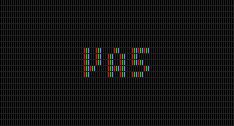

# va5

html5環境の為の、ゲーム向け音響ファイル再生ライブラリ(WebAudio使用)

(※現在まだ未完成です。完動品として [vnctst-audio4](https://github.com/ayamada/vnctst-audio4) もあります)

# 目次

- [特徴](#特徴)
- [使い方](#使い方)
- [FAQ](#faq)
- [用語集](#glossary)
- [開発](#development)
- [TODO](#todo)
- [License](#license)
- [ChangeLog](#changelog)

# 特徴

「ゲーム向け」に特化してチューニングされた、以下の特徴を持つ

- BGMの管理システムとSEの管理システムが分かれている(ついでにvoiceも)
    - BGMは、雑に扱っても問題の起こらない自動フェード機構を持つ(後述)
    - SEは、多重再生の管理/サポート機構を持つ(連打抑制機能付き)
    - voiceは、発声者を示すチャンネル文字列毎に「多重発声の禁止」「他の発声者の発声は許可」を自動的に実現

- 非常にシンプルなインターフェース
    - BGMやSEの操作はゲーム内では頻出であり、この操作が面倒だとゲームの作成コストが大きく上昇する。なので、複雑な状態遷移をシステム内部で厳密に管理しつつも、実際のBGM/SE再生指示は非常に簡潔に行えるようにした

- 雑に扱っても問題の出ないシステム
    - たとえインターフェースがシンプルであっても「この順番で関数を実行しなくてはならない」「○○中にこの処理を行ってはならない」「この種類の例外を捕捉しなくてはならない」的な「約束事」が大量にあったのでは全く意味がない。そのような「約束事」を極力なくすように工夫している。つまり「雑に、タイミング等を気にせずに適当に実行しても問題ない」。

- BGMの自動フェード機構付き
    - 「現在再生中のBGMのフェードアウトを行い、それが完了してから次のBGMを再生する」というケースがBGMの再生では要求される。これは非同期処理になり自前で書くと面倒なものだが、この処理を「次の再生を行う」指示だけで実現できる
    - 上記だけではなく、「ゲーム内でシーン移動したのに合わせてBGMのフェードアウトを開始したが、すぐにまたシーン移動があったので、フェードアウトはそのままで次に再生するBGMだけ差し替えたい」「すぐに元のシーンに戻ってきたので、フェードアウトを中断して、現在のフェード音量からフェードインして元の音量まで戻す」といった機能にも対応している
    - もちろんこれらも「非常にシンプルなインターフェース」と「雑に扱っても問題の出ないシステム」の中にあり、ライブラリの利用者が内部の状態遷移を気にする必要はない

- 2018年頃の各ブラウザの[自動再生ポリシー変更](http://ch.nicovideo.jp/indies-game/blomaga/ar1410968)に対応

- [RPGアツマール](http://game.nicovideo.jp/atsumaru/)や[itch.io](https://itch.io/)のような「iframeによるサンドボックス内環境」での再生にも対応
    - 具体的には http://ch.nicovideo.jp/indies-game/blomaga/ar1156958 と同等の対応を行うようにした

- ライセンスとして[zlib風ライセンス](#license)を採用
    - 当ライブラリの利用時にcopyright文等を表示させる義務はない

- html5環境特有の様々なバッドノウハウ対応を内包

- 最近のes構文をサポートしていないieでスクリプトを読み込んでも例外を出さない(もちろん音は出ない)

- 小サイズの単一ファイルとしてbuildされている
    - ファイルサイズは32kほど

- google closure compiler向けのexternsファイル同梱

# 使い方

http://va5.tir.jp/demo/ にオンラインデモがあります。
コードサンプルも兼ねています。

詳細なリファレンスは [REFERENCE.md](REFERENCE.md) を参照(まだ整備中)。

## Install

- おそらく `npm i va5` して `import * as va5 from "va5"` (未確認)

- もしくは、githubのreleaseページからzipをダウンロードして `va5.min.js` を取り出し `script` タグで読み込む(確認済)

# FAQ

- va5の名前の由来
    - [vnctst-audio4](https://github.com/ayamada/vnctst-audio4)の後継ライブラリだからです

- 事前ロードされている筈なのに即座に再生が開始しない時がある
    - ブラウザ側の[自動再生ポリシー](http://ch.nicovideo.jp/indies-game/blomaga/ar1410968)の為です。この制限が働いている環境では「画面をタッチする」「マウスでクリックする」「キーボード入力する」等の操作後でないと再生が開始されません
    - この問題を避ける為に「ゲーム起動後のタイトル画面ではBGMは鳴らさない」等の工夫が必要かもしれません

- オーディオファイルはどのファイル形式を使えばよいの？
    - m4a(aac)が一番マシです。ほとんどの環境で再生でき、音質も良好です。ただしロード時に曲末尾に無音部分が勝手に追加されてしまうケースがあります
    - mp3はほとんどの環境で再生できますが、ロード時に曲の頭と末尾に無音部分が勝手に追加されてしまうケースがあります。曲の頭に入る方は場合によっては問題となります(SEが遅れたり、BGMのタイミングがずれたりする)
    - oggはモバイル環境で対応していないケースが多いですが、無音部分が勝手に追加されるケースは基本ありません。

- どうやってm4aつくるの！？
    - ffmpeg使いましょう。使い方は今すぐwebで検索。
    - `ffmpeg -i input.wav -vn -acodec aac -ar 44100 -ab 64k -ac 1 output.m4a`
        - `-i input.wav` : 元ファイルを指定。wav以外でも大体対応してる
        - `-ar 44100` : サンプリングレート。全音源で 44100 もしくは 48000 のどちらかに統一するのを推奨。どちらがよいかは何とも言えない
        - `-ab 64k` : ビットレート指定
        - `-ac 1` : 1で強制モノラル化、2でステレオ
        - `output.m4a` : 生成後のファイル名を指定

- ループBGMのループポイントに無音部分が入ってしまう
    - 前述の通り、m4aとmp3は無音部分が勝手に追加されてしまうケースがあります。これを回避するには、LS(LOOPSTART)とLL(LOOPLENGTH)を指定してください。このパラメータの詳細はリファレンスにあります。

- コンソールにログを出したくない
    - `va5.setConfig("is-output-error-log", false)` してください。詳細はリファレンス参照。

- 明示的にGCとかする必要ある？
    - 小さいゲームでは不要です。使い終わった再生チャンネルは自動的に破棄されます。
    - 大きいゲームでも基本不要ですが、一旦loadされた音源はunloadされるまでは内部で保持され続けるので、あまりにBGMやvoiceのファイルが多い場合は個別にunloadした方がよいでしょう。
        - リファレンスで `va5.unloadIfUnused()` `va5.unloadAllIfUnused()` `va5.getConfig("is-unload-automatically-when-finished-bgm")` の項目を参照してください。普通にunloadするよりも適切な場合があります。

- va5.init() は実行した方がよいの？
    - スマホ等では「タッチ等をトリガーとしてWebAudioのresumeを行う」必要がある為、なるべく早い段階で実行した方がよいです。ただし未実行でも音源再生の際に自動的に実行されるので、必須ではありません。
    - 複数回実行しても問題はありません。

- `va5.min.js` を再度closure-compilerにかけたら動かなくなった
    - `va5.min.js` は既にclosure-compilerによって最適化されているので、再度closure-compilerにかけてもそれ以上良くはならないです。
    - それでも再度closure-compilerにかけたい場合は、 `va5_externs.js` の他に `src/internal_externs.js` もexterns指定してください。これで通る筈です。

# Glossary

- BGM
    - 基本的には同時に1種類だけを再生するタイプの再生種別。
        - ただし「BGM楽曲と環境音を同時に再生したい」時の為に、チャンネルidを個別に指定する事で複数同時再生を行う事も可能。
    - デフォルトではループ再生となる(オプション指定で非ループ再生も可能)。
    - あるBGMを再生中に別のBGMを再生しようとすると自動的に、まず現在再生中のBGMをフェードアウト終了させてから次のBGMの再生が開始される。

- SE
    - 同時に多数の再生を行うタイプの再生種別。

- voice
    - 同時に多数の再生を行うタイプの再生種別ではあるが、1つのvoiceの発声元からは最大1つだけしか発声されないように制御されるタイプの再生種別。
    - 用途としてはSEに近いが、内部での扱いはBGMと同種。 `va5.getConfig("is-unload-automatically-when-finished-bgm")` のような設定項目はvoiceにも適用される。

- チャンネル(channel/ch)
    - 実際の音再生を担当するインスタンス的なもの。通常はbgm/se/voiceの各play毎に生成される。
    - チャンネルの実体はva5の内部に隠されており、各チャンネルを指定するid(通常は文字列)だけが外側に渡される。このチャンネルidを通じて、特定の再生音に対して停止やパラメータ変更の指示を行ったり、また別の新しい音源の再生で上書きしたり等を行える。
    - チャンネルidはbgmとvoiceでは任意の名前を付けられる(特にvoiceは指定推奨)。しかしseでは動的生成されたidしか使えない(任意の名前にする事はできない)。

# Development

[DEV.md](DEV.md) を参照

# TODO

- 不具合対応予定、未実装項目、将来実装予定の項目は [DEV.md](DEV.md) に書いています

# License

zlib風ライセンスとします。

- ライセンスの条項全文は [LICENSE](LICENSE) にあります(英語)。
- 当ライブラリの利用時にcopyright文等を表示させる義務はありません。
- zlibライセンスの日本語での解説は https://ja.wikipedia.org/wiki/Zlib_License 等で確認してください。

# ChangeLog

- 1.0.0 (20XX-XX-XX)
    - 正式リリース(予定)

- 0.1.1 (2020-12-06)
    - 試験リリース3

- 0.1.0 (2020-11-14)
    - 試験リリース2

- 0.0.1 (2020-11-14)
    - 試験リリース(まだ実装が不完全)

