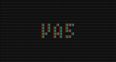

# va5

html5環境の為の、ゲーム向け音響ファイル再生ライブラリ

# 目次

- [特徴](#特徴)
- [使い方](#使い方)
- [オンラインデモ](#オンラインデモ)
- [FAQ](#faq)
- [Development](#development)
- [TODO](#todo)
- [License](#license)
- [ChangeLog](#changelog)

# 特徴

現在準備中

# 使い方

現在準備中

リファレンスは [REFERENCE.md](REFERENCE.md) を参照

# オンラインデモ

現在準備中

# FAQ

- どのファイル形式がよいの？
    - m4a(aac)が一番マシです

- ループBGMのループポイントに無音部分が入ってしまう
    - LS(LOOPSTART)とLL(LOOPLENGTH)を指定してください。詳細は後で書きます

- va5.min.js を再度closure-compilerにかけたら動かなくなった
    - va5.min.js は既にclosure-compilerによって最適化されているので、再度closure-compilerにかけてもそれ以上良くはならないです。
    - それでも再度closure-compilerにかけたい場合は、 va5_externs.js の他に src/internal_externs.js もexterns指定してください。これで通る筈です。

# Development

[DEV.md](DEV.md) を参照

# TODO

- ドキュメントの英語化

# License

zlib風ライセンスとします。

- ライセンスの条項全文は [LICENSE](LICENSE) にあります(英語)。
- 当ライブラリの利用時にcopyright文等を表示させる義務はありません。
- zlibライセンスの日本語での解説は https://ja.wikipedia.org/wiki/Zlib_License 等で確認してください。

# ChangeLog

- 0.1.0 (2020-XX-XX)
    - 現在制作中

